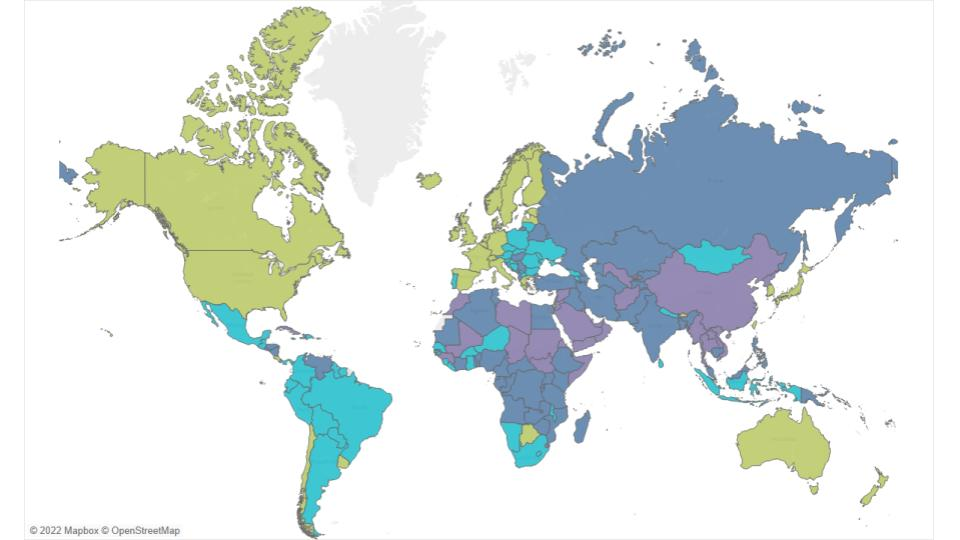

# Digital Repression and Democracy EDA
A look at the state of digital repression and its relation with the political regimes in the world from an Exploratory Data Analysis.

### Welcome!

Thank you for taking an interest in my project 🙂

In this project I've worked with:

![python]https://img.shields.io/badge/Python-FFD43B?style=for-the-badge&logo=python&logoColor=blue
![pandas]https://img.shields.io/badge/Pandas-2C2D72?style=for-the-badge&logo=pandas&logoColor=white
![numpy]https://img.shields.io/badge/Numpy-777BB4?style=for-the-badge&logo=numpy&logoColor=white

![VSC]https://img.shields.io/badge/VSCode-0078D4?style=for-the-badge&logo=visual%20studio%20code&logoColor=white

Python 🐍 ·  Pandas 🐼 ·  Numpy 🧮 ·  Matplotlib 📈 ·  Seaborn 📉 ·  Plotly 📊 ·  Tableau  📈

# Digital Repression  & Political Regimes : A Global Panorama

--------------------------------------------------------------------------------------------------------------------------------------------

### Hypothesis

We are going to study the relationship between democratic quality and digital repression. We want to answer questions like:
 - is it true that the least democratic countries are always the most repressive?
 - what exactly is digital repression?
 - what repressive methods characterize the different political regimes?
 - is there any relationship between the different types of digital repression?

 ### Sources

Feldstein, Steven (2022), “AI & Big Data Global Surveillance Index (2022 updated)”, 
https://data.mendeley.com/datasets/gjhf5y4xjp/4

Varieties of Democracy (V-Dem),
https://www.v-dem.net/

# The 4 types of regimes

- Factors to measure the democracy index 'V-Dem Democracy Index':
The index is based on two principles: electoral and liberal.

'Electoral' refers to how representative the system is, taking into account whether the elections are fair and free, and whether there are independent media in the country in question.

'Liberal' refers to measures on the rule of law and the rule of law, transparency, or civil liberties.

- Classification of regimes:
The V-Dem Democracy Index is used to characterize and classify political regimes. This is important in order to be able to detect when one enters or leaves each of them, that is, at what point democracy erodes and approaches autocracy, or, conversely, when a regime advances from autocracy towards democracy.

We then have 4 types of regimes:
- liberal democracies (LD)
- electoral democracies (ED)
- electoral autocracies (EA)
- closed autocracies (CA)

# Count of countries according to their type of regime

We have 179 countries in the dataset (currently there are 193, but 14 have limited international recognition).
However, it does seem to us a significant sample space, although discouraging: more than half of the countries are not democracies.

# Let's look at the Indices of Democracy and Repression of all countries:

