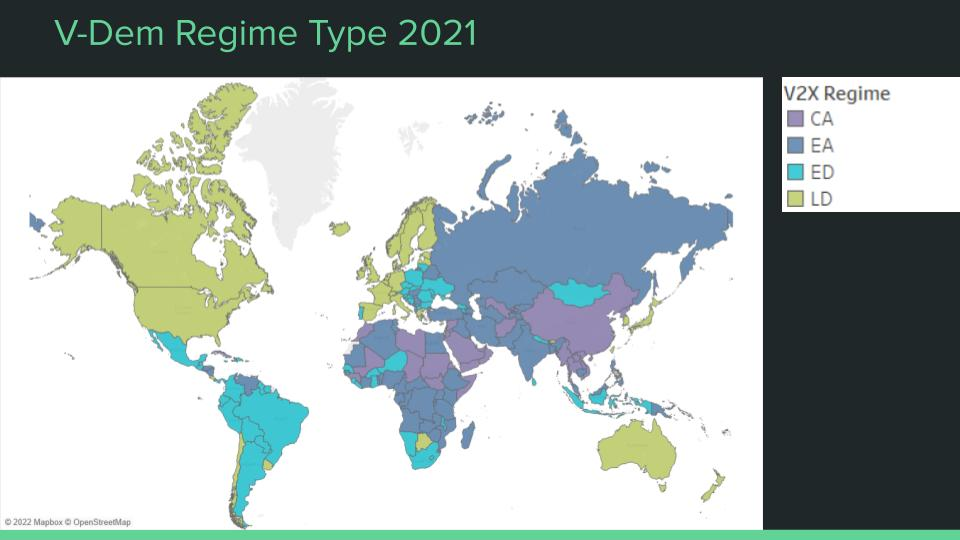

# Digital Repression and Democracy EDA
A look at the state of digital repression and its relation with the political regimes in the world from an Exploratory Data Analysis.

### Welcome!

Thank you for taking an interest in my EDA 🙂

In this project I've worked with:

Python 🐍  ·  Pandas 🐼  ·  Numpy 🧮  ·  Matplotlib 📈  ·  Seaborn 📉  ·  Plotly 📊  ·  Tableau  📈

I hope you enjoy my work as I have while doing it!

------------------------------------------------------------------------------------------------------------------------------------------------------

### Hypothesis

We are going to study the relationship between democratic quality and digital repression. We want to answer questions like:
 - is it true that the least democratic countries are always the most repressive?
 - what exactly is digital repression?
 - what repressive methods characterize the different political regimes?
 - is there any relationship between the different types of digital repression?

 ### Sources

Feldstein, Steven (2022), “AI & Big Data Global Surveillance Index (2022 updated)”, 
https://data.mendeley.com/datasets/gjhf5y4xjp/4

Varieties of Democracy (V-Dem),
https://www.v-dem.net/

# The 4 types of regimes

- Factors to measure the democracy index 'V-Dem Democracy Index': the index is based on two principles:

'Electoral' refers to how representative the system is, taking into account whether the elections are fair and free, and whether there are independent media in the country in question.

'Liberal' refers to measures on the rule of law and the rule of law, transparency, or civil liberties.

- Classification of regimes:
The V-Dem Democracy Index is used to characterize and classify political regimes. This is important in order to be able to detect when one enters or leaves each of them, that is, at what point democracy erodes and approaches autocracy, or, conversely, when a regime advances from autocracy towards democracy.

We then have 4 types of regimes:
- Liberal Democracies (**LD**)
- Electoral Democracies (**ED**)
- Electoral Autocracies (**EA**)
- Closed Autocracies (**CA**)

# World map according to regime

We have 179 countries in the dataset (currently there are 193, but 14 have limited international recognition).
However, it does seem to us a significant sample space, although discouraging: more than half of the countries are not democracies.

# Indices of Democracy and Repression of all countries

# Variables for measuring digital repression

Digital repression is measured with 8 variables, distributed in 5 categories:

1. Surveillance: how comprehensive is the monitoring of political content on social networks carried out by the government and its agents.
2. Censorship of information and/or political content:
- frequency of use of filters on the Internet: use of tools that prevent a user from accessing different websites, applications, platforms, services on the Internet, etc.
- degree of factual censorship in social networks
3. Manipulation and social disinformation, that is, dissemination of misleading views and false information to influence the population, by:
- the government and its agents
- political parties and their candidates
4. Blocks to the access of:
- Internet
- social networks
5. Arrests of users for posting political content on the network.

# Do you want to discover more? 

Please visit https://github.com/irene-glez/Digital-Repression-EDA/blob/main/src/notebooks/eda.ipynb

Many Thanks!
--------------------------------------------------------------------------------------------------------------------------------------------------

